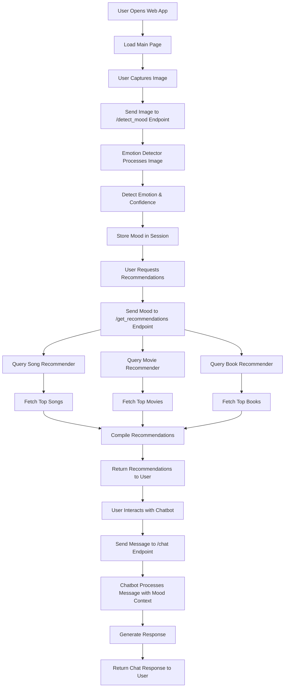

# Methodology Flow Diagram for Mood-Based Recommendation System

## Overview
This diagram illustrates the step-by-step methodology or workflow of the mood-based recommendation system, from user interaction to recommendation delivery.

## Key Steps in the Methodology

1. **User Access**: User opens the web application in a browser.
2. **Image Capture**: User captures an image (e.g., facial expression) via webcam or upload.
3. **Emotion Detection**: Image is sent to the backend for emotion analysis using a pre-trained model.
4. **Mood Storage**: Detected emotion and confidence are stored in the session.
5. **Recommendation Request**: User requests recommendations based on the detected mood.
6. **Data Query**: Recommenders query respective datasets (songs, movies, books) using mood keywords or mappings.
7. **Response Generation**: Recommendations are compiled and sent back to the user.
8. **Chat Interaction** (Optional): User can interact with the chatbot, which uses mood context for responses.

## Mermaid Flowchart Code

## Steps to Create the Diagram

1. Use a diagramming tool like draw.io, Lucidchart, or Mermaid live editor.
2. Copy the Mermaid code above into the tool.
3. Adjust the layout, colors, and labels for clarity.
4. Export as PNG/PDF for documentation.
